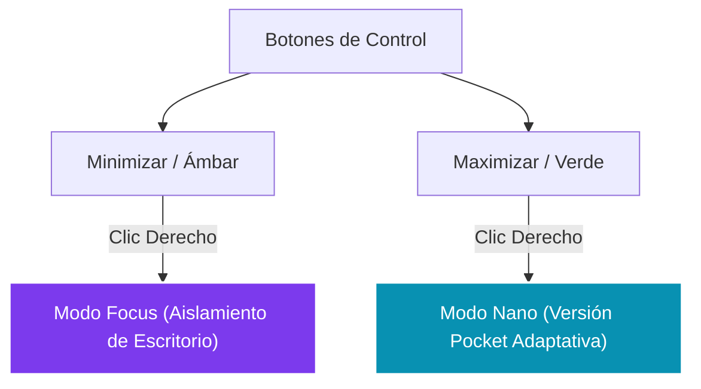

# Relación Filosófica y Evolutiva de la Interfaz
## Conexión entre la Historia de las GUIs y la Propuesta de Windows 12

Este documento establece la **relación conceptual** entre el recorrido histórico de los controles de ventana ([historia_botones_control.md](file:///c:/Desarrollos%20DEV%20daniel/nueva%20propuesta%20windows%2012/historia_botones_control.md)) y la implementación técnica de la nueva propuesta ([informe_iconos.md](file:///c:/Desarrollos%20DEV%20daniel/nueva%20propuesta%20windows%2012/informe_iconos.md)). Asimismo, analiza la justificación de estos nuevos modos y el motivo por el cual rompen con el esquema tradicional de las interfaces clásicas.

---

## 1. ¿Por qué están relacionados la Historia y el Informe?

La relación reside en la **evolución de la metáfora del escritorio**. 
Históricamente, los botones tradicionales (Minimizar, Maximizar, Cerrar) fueron creados para administrar el **espacio físico de la pantalla** en una época donde los monitores eran pequeños y las tareas eran secuenciales. 

Hoy en día, el cuello de botella en la productividad no es la falta de espacio físico, sino el **enfoque y la concentración**. La nueva propuesta de [botones.html](file:///c:/Desarrollos%20DEV%20daniel/nueva%20propuesta%20windows%2012/botones.html) conecta directamente con este reto evolutivo: en lugar de limitar al usuario a "ocultar" o "agrandar" bloques rectangulares estáticos, le permite cambiar el comportamiento operativo del sistema en torno al foco mental y al espacio de pantalla interactivo.

---

## 2. Modos Cotidianos Modificados (La Ruptura con el Pasado)

En la propuesta actual de los botones, notamos que dos de las acciones clásicas que se mantuvieron estáticas desde 1995 se redefinen por completo:

### A. La Minimización Física
*   **Comportamiento Cotidiano:** Esconder la ventana por completo en la barra de tareas.
*   **Nueva Propuesta (Modo Focus):** En lugar de hacer desaparecer la aplicación del usuario, la ventana principal permanece activa mientras **desenfoca y oscurece todo el escritorio y las ventanas circundantes**. El foco visual se clava por completo en la tarea activa, eliminando distracciones externas.

### B. El Tamaño de Ventana Reducido
*   **Comportamiento Cotidiano:** Redimensionar manualmente la ventana a un tamaño pequeño, cortando el texto y generando barras de scroll ineficientes.
*   **Nueva Propuesta (Modo Nano):** Transforma la ventana en una versión **Pocket altamente adaptable y funcional**. El contenido se reordena inteligentemente para seguir siendo usable, sin perder la funcionalidad interna del programa y maximizando el espacio de la pantalla.

---

## 3. Los Dos Modos Especiales (La Innovación de Diseño)

Estas incorporaciones añaden una capa de usabilidad intermedia no presente en los sistemas operativos estándar de hoy:

### A. Modo Focus (Icono de Ojo - Morado)
*   **Justificación:** Activable mediante clic derecho en el botón de minimizar. En lugar de ocultar la ventana actual, el sistema operativo oscurece el fondo de pantalla y desenfoca todas las ventanas de las otras aplicaciones abiertas. Aísla visualmente el software de cara al usuario, mejorando los índices de atención.

### B. Modo Nano (Icono de Estrella - Azul/Cian)
*   **Justificación:** Activable mediante clic derecho en el botón de maximizar. Muta la aplicación completa a su versión de bolsillo ("Pocket"). No es un widget pasivo de sólo lectura, sino que mantiene los flujos de entrada y las funciones completas de la aplicación, reestructuradas mediante un diseño adaptativo inteligente para caber de forma compacta en una esquina flotante.
